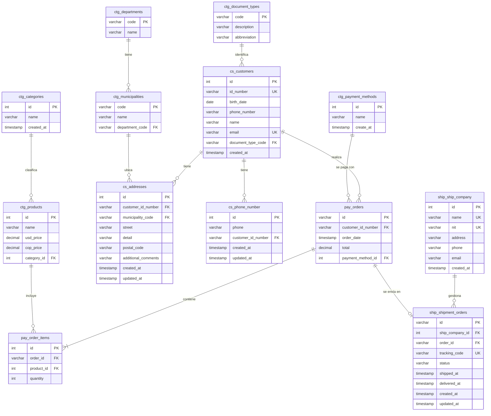

# Modelo Relacional — Customers DB

> Base de datos: `customers_db` | Motor: PostgreSQL 16

El modelo está organizado en cuatro esquemas. Las entidades se nombran con el prefijo del esquema para dejar clara la separación de responsabilidades.

---

## Diagrama

---

## Descripción de esquemas

### `ctg` — Catálogos

Tablas de referencia estáticas que alimentan a los demás esquemas.

| Tabla | Descripción |
|---|---|
| `ctg.departments` | Departamentos de Colombia |
| `ctg.municipalities` | Municipios, referenciados por `department_code` |
| `ctg.categories` | Categorías de productos |
| `ctg.products` | Productos con precio en USD y COP |
| `ctg.payment_methods` | Métodos de pago disponibles |
| `ctg.document_types` | Tipos de documento de identidad |

### `cs` — Core (Clientes)

| Tabla | Descripción |
|---|---|
| `cs.customers` | Clientes registrados |
| `cs.addresses` | Direcciones de envío por cliente |
| `cs.phone_number` | Teléfonos adicionales por cliente |

### `pay` — Pagos

| Tabla | Descripción |
|---|---|
| `pay.orders` | Órdenes de compra |
| `pay.order_items` | Ítems dentro de cada orden |

### `ship` — Envíos

| Tabla | Descripción |
|---|---|
| `ship.ship_company` | Empresas de transporte |
| `ship.shipment_orders` | Órdenes de envío asociadas a órdenes de pago |

---

## Convenciones

| Símbolo | Significado |
|---|---|
| `PK` | Llave primaria |
| `FK` | Llave foránea |
| `UK` | Restricción única |
| `\|\|--o{` | Uno a muchos (obligatorio — opcional) |
| `\|\|--\|\|` | Uno a uno |
| `\|\|--\|{` | Uno a muchos (obligatorio — obligatorio) |
| `\|\|--o\|` | Uno a cero o uno |
